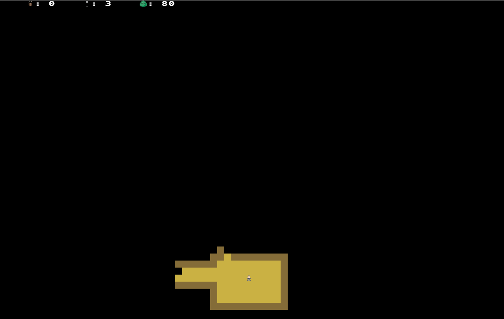
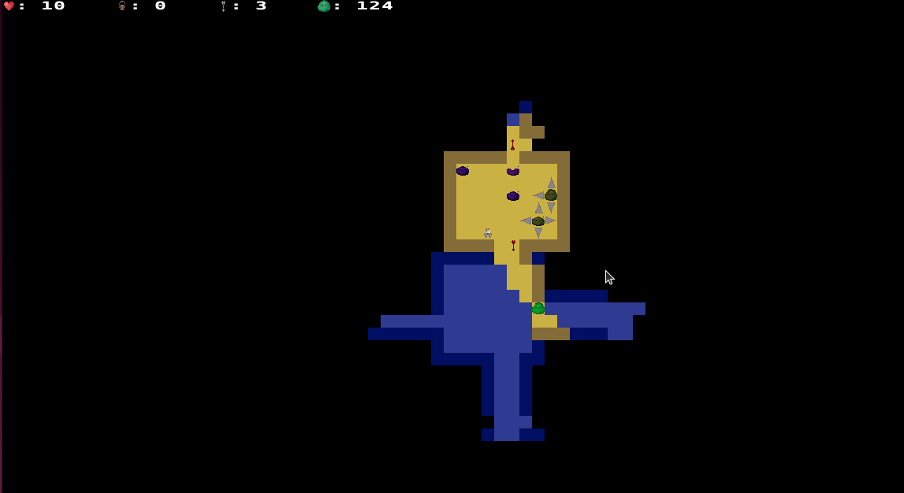

# Roguelike in Rust

    
    

Thesis / Project for the Programming with Rust course. The aim of this project is to create an original work based on individual concepts. Our chosen endeavor involves developing a roguelike game using the Rust programming language. Roguelike games are a distinctive subgenre of role-playing video games known for their immersive dungeon crawling mechanics, procedurally generated levels, turn-based gameplay, tile-based graphics, and the unforgiving aspect of permanent character death. These games often draw inspiration from the captivating narratives found in high fantasy settings, reflecting their origins in tabletop role-playing games such as Dungeons & Dragons. (Reference: https://en.wikipedia.org/wiki/Roguelike)

## Table Of Content

- [Course content](#course-content)
- [Grading](#grading)
- [Getting Started](#getting-started)
  - [Dependencies](#dependencies)
  - [Installation](#installation)
  - [Compile and run](#compile-and-run)
- [Example pictures](#example-pictures)
- [Contribution](#contribution)

## Course content

The purpose of this project is to further explore and solidify the concepts learned in the Programmieren mit Rust course.

Rust ist eine neue Sprache von Mozilla, die sich selber wie folgt beschreibt: "Rust ist eine Systemprogrammiersprache, die blitzschnell läuft, Speicherfehler vermeidet und Threadsicherheit garantiert."

Ziel dieses Kurses ist es, Grundlagen zum Programmieren in Rust zu erlernen und nebenbei zu verstehen, wie Rust seine hochgesetzten Ziele erreicht und bei komplexen Themen wie Memory Management und Nebenläufigkeit neue Wege beschreitet.

Es werden zunächst Grundlagen der Sprache, später Konzepte wie Ownership & Borrowing, Traits & Generics, sowie Lifetimes erklärt. Zum Schluss sollten genug Kenntnisse bestehen, um ein eigenes kleines Projekt zu entwickeln.

Dieser Kurs richtet sich an alle mit einfacher Programmiererfahrung. Die Absicht ist es, allen die Chance zu bieten, sich mit Low-Level Programmierung auseinander zu setzen, insbesondere für jene, die sich mit den gängigen Sprachen dieser Domaine (C/C++) nicht sicher fühlen.

## Grading

| Assignment  | Grade |
| ------------- | ------------- |
| project | passed  |

## Getting Started 
### Dependencies

In order for the scripts to work you will need the following packages:
 * `rust`

 ### Installation

Installation of rust:
 - `curl --proto '=https' --tlsv1.2 -sSf https://sh.rustup.rs | sh`

Cloning the repo:
 - `git clone https://github.com/thob97/roguelike_rust.git`
 - `cd roguelike_rust`

 ### Compile and run
 - `cargo build --release`
 - `cargo run --release`

## Example pictures

    
    
    

## Controls
- arrow keys: movement
- spacebar: sword
- num 1 key: shovel (removes tiles)
- num 2 key: bucket (places tiles)
- num 3 key: bow (shoots arrows)

## Contribution

- [Thore Brehmer](https://github.com/thob97)
- [Qianli Wang](https://github.com/qiaw99)
- Jonny Lam
- David Ly
